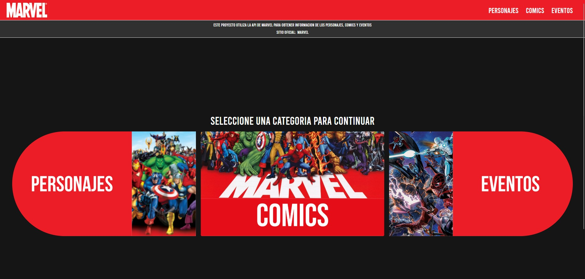

### Marvel API

## Preview

## Descripción del proyecto

> Desarrollado con React, API de Marvel y TailwindCSS.

> El proyecto es una aplicación web que permite visualizar los datos de una API de Marvel.

> La API de Marvel permite obtener datos de personajes, comics, series y otros.  

***El proyecto fue desarrollado con el fin de aprender a usar APIs de terceros.***
